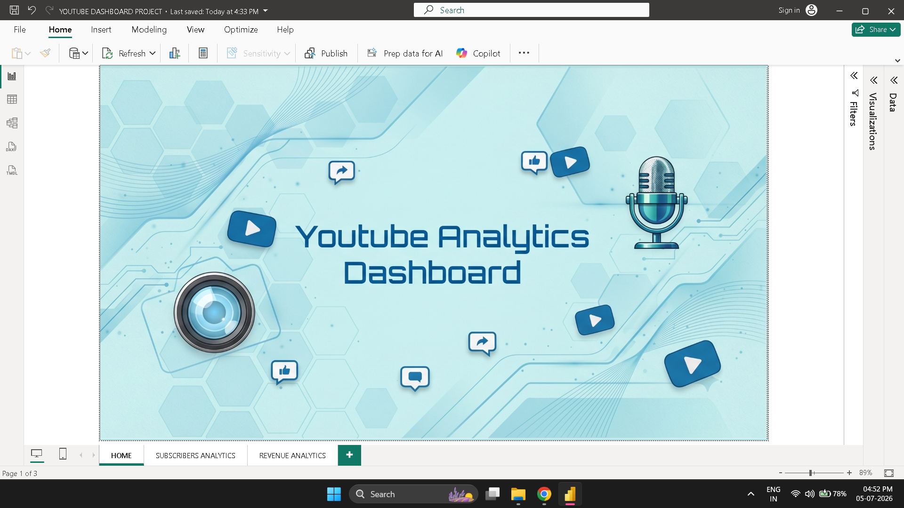
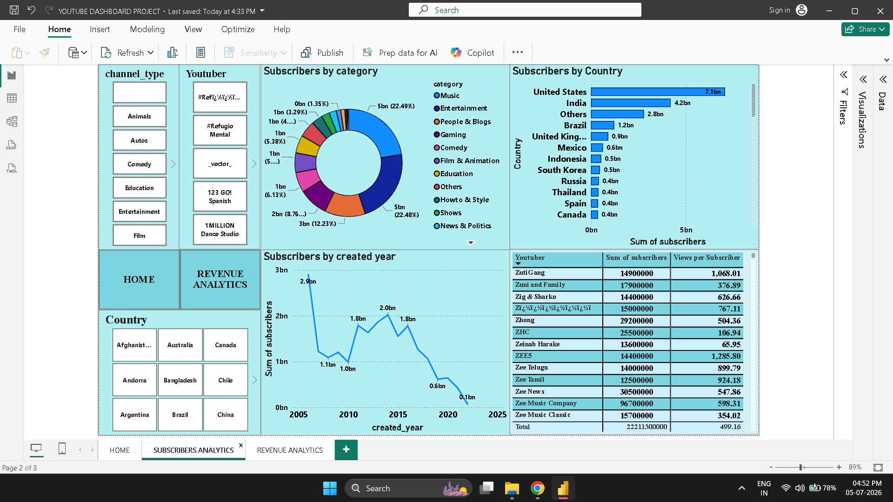
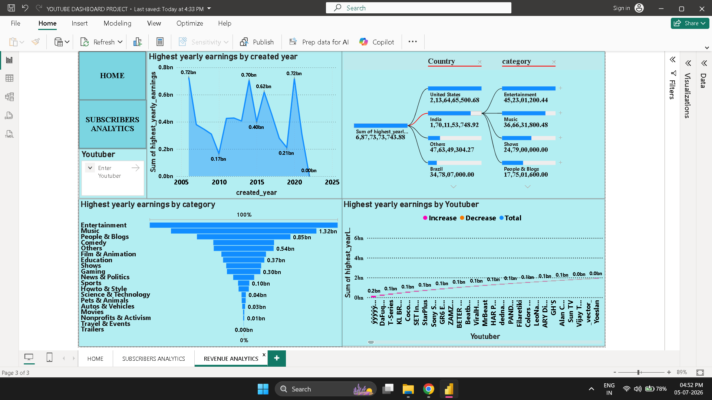

# 📊 YouTube Global Analytics Dashboard


---

## 📖 Project Overview

The **YouTube Global Analytics Dashboard** is an interactive Business Intelligence project developed using **Microsoft Power BI**. The project transforms raw YouTube channel statistics into meaningful visual insights that help users analyze subscriber growth, audience distribution, channel categories, and estimated earnings across different countries.

The dashboard provides an interactive environment where users can explore global YouTube performance through dynamic charts, slicers, KPIs, and advanced Power BI visualizations.

This project was completed as part of our **60-Hour Summer Training Program**.

---

## 🎯 Project Objectives

- Transform raw YouTube statistics into meaningful business insights.
- Analyze subscriber distribution across different content categories.
- Compare YouTube channel performance across countries.
- Visualize yearly subscriber growth trends.
- Analyze estimated yearly earnings by category.
- Build an interactive dashboard using Microsoft Power BI.
- Enable dynamic filtering through slicers.
- Support better data-driven decision making.

---

# 🛠 Tools & Technologies

| Tool | Purpose |
|------|----------|
| Microsoft Excel | Initial data inspection and formatting |
| Microsoft Power BI | Dashboard development |
| Power Query | Data cleaning and transformation |
| DAX | Measures and calculations |
| CSV Dataset | Source data |

---

# 🔄 Project Workflow

```
Raw Dataset
      │
      ▼
Data Cleaning
      │
      ▼
Data Transformation
      │
      ▼
Data Modeling
      │
      ▼
DAX Calculations
      │
      ▼
Dashboard Development
      │
      ▼
Interactive Visualizations
```

---

# 📊 Dashboard Features

✔ Interactive Dashboard

✔ KPI Cards

✔ Donut Chart

✔ Bar Chart

✔ Line Chart

✔ Area Chart

✔ Funnel Chart

✔ Decomposition Tree

✔ Dynamic Slicers

✔ Multi-Page Dashboard

✔ Country-wise Analysis

✔ Category-wise Analysis

✔ Earnings Analysis

✔ Subscriber Trend Analysis

---

# 📂 Dashboard Pages

## 🏠 Home Page

- Dashboard introduction
- Project overview
- Navigation page

---

## 📈 Subscriber Analytics

This page focuses on subscriber demographics and audience trends.

### Insights

- Subscriber distribution by category
- Country-wise subscriber analysis
- Subscribers by channel creation year
- Top YouTube channels by subscribers

---

## 💰 Revenue Analytics

This page analyzes estimated earnings of YouTube channels.

### Insights

- Highest yearly earnings
- Earnings by category
- Earnings by channel creation year
- Country-wise earnings analysis
- Root-cause analysis using Decomposition Tree

---

# 🎛 Interactive Features

The dashboard includes dynamic filtering using:

- Country Slicer
- Category Slicer

These slicers automatically update every visualization on the report page.

---

# 📈 Key Insights

- Music and Entertainment dominate global subscriber share.
- United States and India have the highest concentration of popular YouTube channels.
- Older YouTube channels generally have larger subscriber bases.
- Entertainment generates the highest yearly earnings.
- Subscriber growth and revenue vary significantly across different content categories.

---

# 📁 Repository Structure

```
YouTube-Analytics-Dashboard-PowerBI
│
├── README.md
├── YouTube_Analytics_Dashboard.pbix
├── YouTube_Analytics_Dashboard_Report.pdf
├── YouTube_Analytics_Dashboard_Presentation.pptx
│
├── Dataset
│      └── Cleaned_YouTube_Stats.csv
│
└── Images
       ├── Home_Dashboard.png
       ├── Subscriber_Analytics.png
       └── Revenue_Analytics.png
```

---

# 📸 Dashboard Preview

## Home Page


---

## Subscriber Analytics


---

## Revenue Analytics


---

# 🚀 How to Run

1. Download the repository.
2. Open the `.pbix` file using Microsoft Power BI Desktop.
3. Load the dataset if required.
4. Explore the interactive dashboard.

---

# 👨‍💻 Project Team

**Shagun Gupta**

B.Tech CSE (AI & ML)

United College of Engineering & Research

---

**Reansh Singh**

B.Tech ECE

United College of Engineering & Research

---

# 🎓 Internship Information

**Project Title**

YouTube Global Analytics Dashboard

**Domain**

Data Analytics & Business Intelligence

**Tools Used**

Microsoft Power BI, Microsoft Excel, DAX, Power Query

**Duration**

60-Hour Summer Training Program

---

# ⭐ If you like this project

Please consider giving this repository a ⭐ on GitHub!

